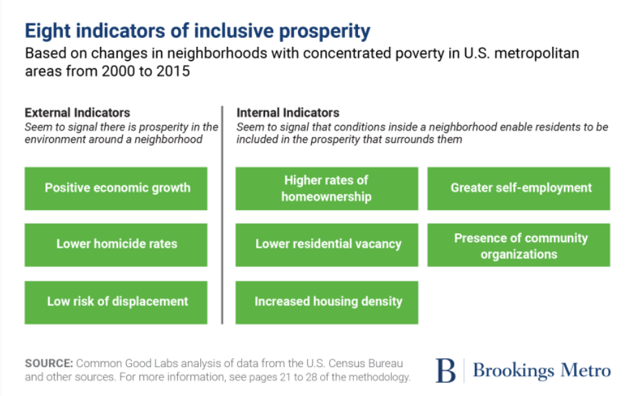

# :house_with_garden: Reducing Poverty without Community Displacement: "Calculating" Indicators of Inclusive Prosperity
Based on the findings of Acharya, R., & Morris, R. (2022). [*Reducing poverty without community displacement: Indicators of inclusive prosperity in U.S. neighborhoods. The Brookings Institution.*](https://www.brookings.edu/research/reducing-poverty-without-community-displacement-indicators-of-inclusive-prosperity-in-u-s-neighborhoods/)

## Table of Contents
1. [Quick Start: How to Use This Repository](https://github.com/shawnadean/indicators-inclusive-prosperity/tree/v4#quick-start-how-to-use-this-repository)
2. [What Are Indicators of Inclusive Prosperity?](https://github.com/shawnadean/indicators-inclusive-prosperity/tree/v4#what-are-the-indicators-of-inclusive-prosperity)
3. [Calculation Metholodgy / Data Dictionary](https://github.com/shawnadean/indicators-inclusive-prosperity/tree/v4#calculation-methodology--data-dictionary)
4. How to Calculate the Indicators of Inclusive Prosperity for Your Community :sparkles:Coming Soon!:sparkles:
</br>

## Quick Start: How to Use This Repository
With [git installed](https://github.com/git-guides/install-git), run the following commands:
```
mkdir inclusive-prosperity
cd inclusive-prosperity
git clone https://github.com/shawnadean/indicators-inclusive-prosperity.git
start calc_indicators_inclusive_prosperity.py
```
and run the code using your IDE. </br></br>
To open the output file, run
```
 cd tableau_input
 start '2021 Duval Indicators of Inclusive Prosperity - sample file.csv'
```
## What Are the Indicators of Inclusive Prosperity?
Through a 15 year study of over 3,500 US neighhborhoods, Acharya and Morris identified 8 indicators that differentiate neighborhoods that are most likely to experience large decreases in poverty rates and no community distplacement from other neighborhoods in concentrated poverty. By applying these findings, we can help community leaders assess need and identify interventions that will maximize the impact of their resources.
<div align="left">
  
</div>
</br>

## Calculation Methodology / Data Dictionary
This methodology is based on the findings of the research study mentioned at the beginning of this file.  We have adapted the methodology to use only publicly available data for Duval County, FL in 2021.

### Criteria for determining the presence of each indicator
| Indicator                | Type     | Criteria for each neighborhood (census tract)                 | Source                                                             |
|:-------------------------------------------------|:---------|:---------------------------------------------------------------------|:------------------------------------|
| Positive Economic Growth | External | in a Metropolitan Statistical Area (MSA) that had positive GDP growth 2006-2021\** | [US Bureau of Economic Analysis API](https://apps.bea.gov/api/signup/) |
| Lower Homicide Rates     | External | in a county with < 25 murders per 100,000 residents | [FL Department of Law Enforcement](https://www.fdle.state.fl.us/CJAB/UCR/Annual-Reports/UCR-Annual-Archives) | 
Low Risk of Displacement* | External | Displacement Risk Ratio (Home Value\/Median Household Income) < 75th percentile of the MSA | [US Census Bureau: American Community Survey](https://www.census.gov/data/developers/data-sets/acs-5year.html) | 
Higher Rates of Home Ownership | Internal | Home Ownership Rate >= 25th percentile of the MSA | " | 
Lower Residential Vacancy | Internal | Residential Vacancy Rate < 75th percentile of the MSA | " | 
Increased Housing Density | Internal | # of Housing Units Built 2010-2019\** > 0 | " | 
Greater Self-Employment | Internal | Self-Employment Rate >= 25th percentile in the MSA | " | 
Presence of Community Organizations | Internal | has >=1 community-building organization located within 1 mile of the center of the census tract | [National Center for Charitable Statistics](https://nccs-data.urban.org/data.php?ds=bmf), [US Census Bureau: Centers of Population](https://www.census.gov/geographies/reference-files/time-series/geo/centers-population.html) |

\*The criteria for Low Risk of Displacement shown here differs greatly from Acharya and Morris' findings due to data limitations.  However, we are working on updating this in the next release. </br>
\*\*These date ranges are based on their relative position to the reported year. For example, 2010-2019 was the closest data available to 10 years prior to the reported year. All other data is for the reported year or as close as possible.
</br>
### Criteria for determining the "Status" of Inclusive Prosperity
When all 3 external indicators are present, the likelihood of a neighborhood achieving inclusive prosperity increases as the number of internal indicators present increases. 
| # of External Indicators Present | # of Internal Indicators Present | Status of Inclusive Prosperity |
|:---------------------------------|----------------------------------|--------------------------------|
3 | >= 4 | Expected
3 | 3 | Likely
3 | 2 | Not Expected
3 | 1 | Decline Likely
<3 | Any # | Expected

### Glossary
- Concentrated Poverty: census tracts with >=30% poverty rate and at least 1,000 residents per square mile
- Inclusive Prosperity: >=10% drop in poverty rate & # of residents within each ethnic group (Asian, Black, Hispanic) will not decline by >5% & the decline, if any, of each ethnic group's % of the census tract's population will not be > 2 standard deviations from each group's mean % of population change among all US census tracts
</br>

### How to Calculate the Indicators of Inclusive Prosperity for Your Community
Complete [Quick Start: How to Use This Repository](https://github.com/shawnadean/indicators-inclusive-prosperity/tree/v4#quick-start-how-to-use-this-repository) first to ensure that you have properly downloaded this repo.

#### Step 0: How to Navigate this Repository
- **images**: images used in this README.md
- **program_input**: input file(s) required to run *calc_indicators_inclusive_prosperity.py*
- **tableau_input**: files needed to build dashboard, includes *2021 Duval Indicators of Inclusive Prosperity - sample file.csv*, which is the output of *calc_indicators_inclusive_prosperity.py*
- **calc_indicators_inclusive_prosperity.py**: python program that calculates the Indicators of Inclusive Prosperity and generates an Excel file for the results in the tableau_input file

#### Step 1: Create a List of Your County's Community Organizations
1. Visit the [NCCS data archive](https://nccs-data.urban.org/data.php?ds=bmf) or browse the web for 'Urban Institute NCCS IRS BUSINESS MASTER FILES'. Download the most recent file for your desired reported year.

2. Open a new blank Excel file.  In Excel, create a query to the file that you just downloaded via Data > Get & Transform Data > Get Data > From File > From Excel Workbook and select your NCCS file.

3. In Excel Power Query, filter rows by your desired county.  Filter the columned named NTEE1 to only include R, S, T, W, V. Remove all columns except Organization Name, NTEE1, Full Address, and any other geographic information.  

4. Save your file and use the Full Address column to generate coordinates for all of the organizations in your file.  We used [geocod.io](https://www.geocod.io/), which offers 2,500 free lookups per day. However, you can use any batch process geocoding service.
   
6. Download your geocoded file, give it a meaningful name, and save it to your local program_input file as a csv.  Open the file and make sure that the column headers match those seen in program_input\2021 Duval NCCS Community Orgs Coordinates.csv

7. Open *calc_indicators_inclusive_prosperity.py*. Change line 27 to reflect the name of your geocoded file. See below for an example:
```
community_orgs_csv = os.path.join(os.getcwd(), 'program_input', 'Your Geocoded File Name.csv')
```
8. Save the .py file.

#### Step 2: Update Your Input Variables
You will need to update the variable constants in lines 6-30 in *calc_indicators_inclusive_prosperity.py* to customize this program to your desired county and reported year.  Use the table below to learn what these variables represent:

| Variable Name | Data Type | Description |
|----------------------------------|----------------------------------|--------------------------------|
```bea_UserID``` | string | your unique UserID that allows you to access the Bureau of Labor Statistics API;  [Register to use the BEA API here](https://apps.bea.gov/api/signup/) and you will receive your UserID via email.
```CBSA_FIPS_code``` | string | the FIPS (Federal Information Processing Standards) code for the CBSA (Core-based Statistical Area) which your county is located in;  FIPS codes can change occasionally, so make sure any FIPS codes you use are accurate as of your reported year.
```reportedYear``` | int | the year for which you would like to calculate the Indicators of Inclusive Prosperity, usually the year of the most recent census data
```murders_per_100000``` | float | # of murders per 100,000 residents in your county's MSA (Metropolitan Statistical Area) as defined by ((Total # of Murders in MSA) / (Total # of People in MSA)) * 100,000; Your data source might differ as crime reporting differs from state to state.  We used the most recent [County and Municipal Offense Data from the Florida Department of Law Enforcement](https://www.fdle.state.fl.us/CJAB/UCR/Annual-Reports/UCR-Annual-Archives).
```state_FIPS``` | string | the FIPS code for the state that your county is located in
```county_fp_int``` | int | the FIPS code for your county
```county_MSA_FIPS``` | string | an unordered list of the FIPS codes for all the counties located within your reported county's MSA; All codes should be exactly 3 digits, including leading 0s
</br>
The following variable constants contain the names for variables accessed through the US Census Bureau API for the American Community Survey.  These names can change every few years, meaning that the name that points to one variable in a given year might point to a different variable in another year. For each variable constant, use the associated link (change the year to your reported year) to ensure that the name matches the appropriate label: 
</br>
</br>

| Variable Constant | Link | Label |
|----------------------------------|----------------------------------|--------------------------------|
```total_population``` | https://api.census.gov/data/2021/acs/acs5/profile/groups/DP05.html | Estimate!!SEX AND AGE!!Total population |
```median_home_value``` | https://api.census.gov/data/2021/acs/acs5/profile/groups/DP04.html | Estimate!!VALUE!!Owner-occupied units!!Median (dollars) |
```home_ownership_rate``` |"| Percent!!HOUSING TENURE!!Occupied housing units!!Owner-occupied |
```vacancy_rate``` |"| Percent!!HOUSING OCCUPANCY!!Total housing units!!Vacant housing units |
```built_prev_10``` |"| Estimate!!YEAR STRUCTURE BUILT!!Total housing units!!Built 2010 to 2019* |
```median_household_income``` | https://api.census.gov/data/2021/acs/acs5/subject/groups/S2503.html | Estimate!!Occupied housing units!!Occupied housing units!!HOUSEHOLD INCOME IN THE PAST 12 MONTHS (IN 2021** INFLATION-ADJUSTED DOLLARS)!!Median household income (dollars) |
```with_self_employment_income``` | https://api.census.gov/data/2021/acs/acs5/groups/B19053.html | Estimate!!Total:!!With self-employment income |
```poverty_rate``` | https://api.census.gov/data/2021/acs/acs5/subject/groups/S1701.html | Estimate!!Percent below poverty level!!Population for whom poverty status is determined |


*This variable should reflect the total housing units built 10 years prior to your reported year. </br>
**This variable should reflect median household income for you reported year.


#### Step 3: Change Your Output File Name & Run the File
On line 30, put a meaningful name for your results file.  See below for an example: </br>
```output_file_path = os.path.join(os.getcwd(), 'tableau_input', 'Name of Your Output File.csv')```
</br>
The file will be available in your inclusive-prosperity\tableau_input folder.

#### Step 4: Build Your Tableau Dashboard


